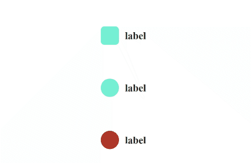

# react-checkbox-css

A checkbox based on react thats easy to customize

## Example



## Usage

```js
import React from "react";
import CheckBox from "react-checkbox-css";

function App() {
  const [isChecked, setIschecked] = useState(false);
  return (
      <CheckBox
        value={isChecked}
        label="label"
        labelColor="#242424"
        checkedColor="#242424"
        unCheckedColor="#7fffd4"
        iconColor="#ffffff"
        onChange={() => {
          isChecked ? setIschecked(false) : setIschecked(true);
        }}
      />
  );
}
```

```js
import React from "react";
import CheckBox from "react-checkbox-css";

function App() {
  const [isChecked, setIschecked] = useState(false);
  return (
      <CheckBox
        value={isChecked}
        label="label"
        labelColor="#242424"
        checkedColor="#242424"
        unCheckedColor="#7fffd4"
        iconColor="#ffffff"
        style={{ borderRadius: 20 }}
        onChange={() => {
          isChecked ? setIschecked(false) : setIschecked(true);
        }}
      />
  );
}
```

```js
import React from "react";
import CheckBox from "react-checkbox-css";

function App() {
  const [isChecked, setIschecked] = useState(false);
  return (
      <CheckBox
        value={isChecked}
        label="label"
        labelColor="#242424"
        checkedColor="linear-gradient(45deg, #797979, #242424)"
        unCheckedColor="brown"
        iconColor="#ffffff"
        style={{ borderRadius: 20 }}
        onChange={() => {
          isChecked ? setIschecked(false) : setIschecked(true);
        }}
      />
  );
}
```

## Props

Common props you may want to specify include:

- `value` - value of checkbox
- `label` - set label of checkbox
- `labelColor` - set color of label of checkbox
- `checkedColor` - set background color of checkbox when checked
- `unCheckedColor` - set background color of checkbox when unchecked
- `iconColor` - set color of check icon
- `onChange` - onchange function of checkbox
- `style` - can do custom styling

## Available Scripts

In the project directory, you can run:

### `npm start`

Runs the app in the development mode.\
Open [http://localhost:3000](http://localhost:3000) to view it in your browser.

This has a starter project using this package you can test it there

### `npm run build`

Builds the package for production to the `dist` folder.\
